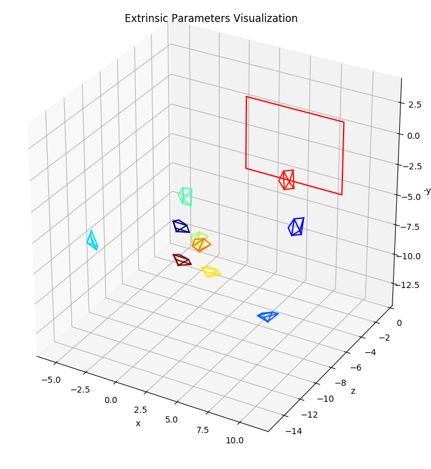
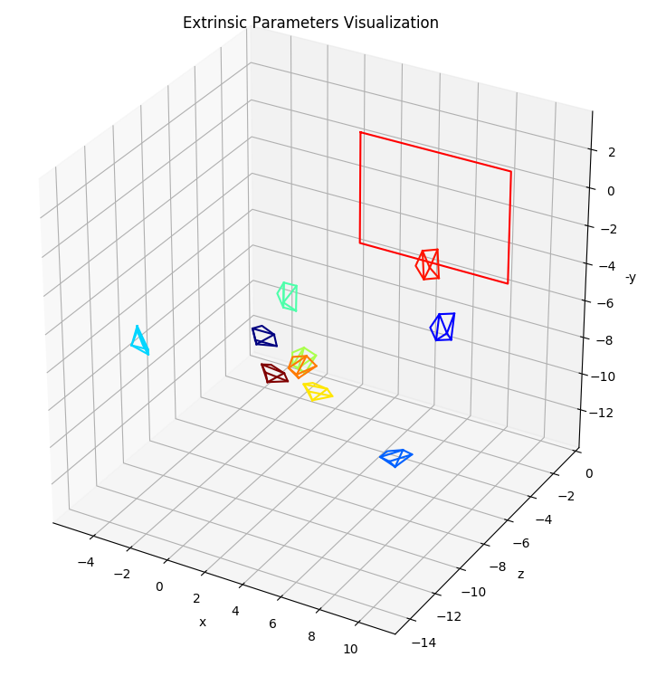

# Camera Calibration
Practice how to implement camera calibration.

## Introduction

### 1. Coordinate System
We could divide coordinate into four kinds, World, Camera, Fil, and Pixel coordinates.

World Coordinates   |   Camera Coordinates  |   Film Coordinates    |   Pixel Coordinates
:------------------:|:---------------------:|:---------------------:| :------------------:
U                   |           X           |           x           |           u
V                   |           Y           |           y           |           v
W                   |           Z           |                       |                       

Between Camera Coordinates and Film Coordinates, there is a relationship that:

 

Between World Coordinates and Camera Coordinates, there is a relationship that:

Between Film Coordinates and Pixel Coordinates, there is a relationship that:

some skew effect would happen

### Summary

World Coordinates   |  |   Camera Coordinates  |  |   Film Coordinates    |  |   Pixel Coordinates
:------------------:|--|:---------------------:|--|:---------------------:|--|:------------------:
U                   |  |           X           |  |           x           |  |           u
V                   |  |           Y           |  |           y           |  |           v
W                   |  |           Z           |  |                       |  |   

World Coordinates   |  |   Camera Coordinates  |   Film Coordinates    |   Pixel Coordinates
:------------------:|--|:---------------------:|:---------------------:|:------------------:
U                   |  |          X            |                       |          u
V                   |  |          Y            |  |          v
W                   |  |          Z            |                       |

World Coordinates   |   Camera Coordinates  |   Film Coordinates    |   Pixel Coordinates
:------------------:|:---------------------:|:---------------------:|:------------------:
U                   |                       |                       |          u
V                   |                       |                       |          v
W                   |                       |                       |

From above relations of each coordinate, we could get:

### 2. Camera Calibration

In the 3D coordinate and in the image coordinate, we could find a pair of points. We suppose it as P and p.

From the above summary, we know that:

So we could know each correspondence gives 2 equations, while M has 11 DoF, so we need at least 6 correspondences, however, we often use more as measurement are often noisy.

we could use SVD to solve m: 

where K is upper triangular matrix, R is orthogonol matrix, we could use RQ decomposition to get K(intrinsic) and R(rotation), and then get T(translation) by multiplying C's inverse to CT.

## Implementation Proedure

Because 3D calibration rig is hard to make, so we use a 2D pattern(e.g. a chessboard) to implement.
> Hint. set the World Corrdinate system to the corner of chessboard, and all points on the chessboard line in one plane.

### 1. Find the Homography matrix

Using the world coordinate and pattern coordinate to find the H:

Because chessboard is a 2D pattern, we cound think all points in the pattern don't have z-axis value. Then, H matrix is a 3x3 matrix:

, 

we could rewrite it into matrix:

![equation_G4](https://latex.codecogs.com/svg.latex?%5Cinline%20%5Cbegin%7Bbmatrix%7D%20U_%7B0%7D%20%26%20V_%7B0%7D%20%26%201%20%26%200%20%26%200%20%26%200%20%26%20-u_%7B0%7DU_%7B0%7D%20%26%20-u_%7B0%7DV_%7B0%7D%20%26%20-u_%7B0%7D%5C%5C%200%20%26%200%20%26%200%20%26%20U_%7B0%7D%20%26%20V_%7B0%7D%20%26%201%20%26%20-v_%7B0%7DU_%7B0%7D%20%26%20-v_%7B0%7DV_%7B0%7D%20%26%20-v_%7B0%7D%5C%5C%20...%20%26%20...%20%26%20...%20%26%20...%20%26%20...%20%26%20...%20%26%20...%20%26%20...%20%26%20...%5C%5C%20U_%7Bn-1%7D%20%26%20V_%7Bn-1%7D%20%26%201%20%26%200%20%26%200%20%26%200%20%26%20-u_%7Bn-1%7DU_%7Bn-1%7D%20%26%20-u_%7Bn-1%7DV_%7Bn-1%7D%20%26%20-u_%7Bn-1%7D%5C%5C%200%20%26%200%20%26%200%20%26%20U_%7Bn-1%7D%20%26%20V_%7Bn-1%7D%20%26%201%20%26%20-v_%7Bn-1%7DU_%7Bn-1%7D%20%26%20-v_%7Bn-1%7DV_%7Bn-1%7D%20%26%20-v_%7Bn-1%7D%20%5Cend%7Bbmatrix%7D%20%5Cbegin%7Bbmatrix%7D%20h_%7B11%7D%5C%5C%20h_%7B12%7D%5C%5C%20h_%7B13%7D%5C%5C%20h_%7B21%7D%5C%5C%20h_%7B22%7D%5C%5C%20h_%7B23%7D%5C%5C%20h_%7B31%7D%5C%5C%20h_%7B32%7D%5C%5C%20h_%7B33%7D%20%5Cend%7Bbmatrix%7D)

* In the implementation, we should use the points in the pattern and its correapondence in the world coordinate to produce the matrix P.
* Using SVD to solve Ph=0 equation to figure out the h, which is 9x1 matrix. In SVD solution, the last column of V's transpose matrix is the answer.
* Reconstructing the h into H, which is 3x3 matrix.
* Because P(h) equal to zero, P(-h) will equal to zero too, we always set the last element positive.

### 2. Find the symmetric positive definite matrix

Using the homography matrix to find out the b:

From these two equations, we could get:

* Using previous homography matrix to combine the V matrix, which is 2x6 matrix.
* Using SVD to solve Vb=0 equation to figure out the b.
* Recontructing the b into B, which is 3x3 symmetric positive definite matrix.
* Because V(b) equal to zero, V(-b) will equal to zero too, we always set the last element positive.

### 3. Get the intrinsic matrix

* Using Cholesky Decomposition to solve out K.
* K is an upper triangular matrix and its inverse is also an upper triangular matrix, so B is a lower triangular matrix multiply to upper triangular matrix, then we could use Cholesky Decomposition to get the inv(K), and do the inverse to find out the K.

### 4. Get the extrinsic matrix

* Using the equations above to get the translation and rotation matrix, then the rotation matrix need to use the Rodrigues function to get its rotation vector.
* The images of chessboard will not always in same orientation, so we should remember its original homography matrix and use its rotated image to calculate the right intrinsic matrix.

## Experimental Result

The intrinsic matrix of using opencv library and implementing myself.

We could see the results of these two intrinsic matrixs are very similar.

And the extrinsic results are:

OpenCV                      |       Ours 
:--------------------------:|:----------------------------:
 |
